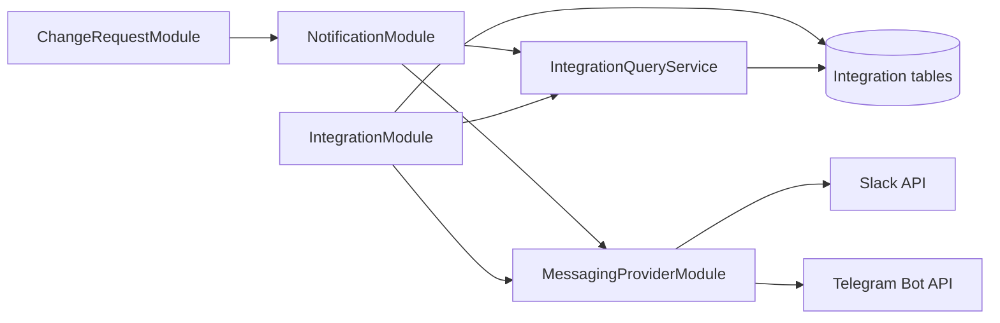

# DBFlow Slack and Telegram Action Notification Design

- Date: 2026-07-30
- Status: Approved after self-review
- Scope: API, web settings, provider administration, deployment validation
- Supersedes: Telegram notification portions of `2026-07-17-dbflow-assignments-profiles-telegram-design.md`

## 1. Goal

Notify the people who can act on a Change Request through one personally selected
messenger channel. DBFlow remains usable when Slack or Telegram is not configured,
and notification failures never roll back a committed workflow transition.

## 2. Product Decisions

- Notifications are personal DMs, not shared-channel posts.
- A user selects one preferred channel: Slack or Telegram.
- Action-request events only:
  - submit -> reviewer
  - review approval -> every pending approver
  - reassignment while work is actionable -> newly actionable assignees
- Author result, apply, rollback, reminder, and escalation notifications are out of scope.
- If an assignee has active delegates, exclude the original assignee and notify every
  active delegate. Deduplicate final recipients by DBFlow user ID.
- Message fields are limited to title, environment, requester name, requested action,
  and the DBFlow Change Request detail URL.
- Each user stores an `en` or `ko` locale. The same locale controls the web UI and DM
  template. Language selection lives under Settings, not in the sidebar.
- Slack supports one installed workspace per DBFlow instance.
- Slack workspace installation is an admin OAuth v2 flow. User identity linking is a
  separate Sign in with Slack OpenID Connect flow.
- Telegram supports a one-time `/start <token>` deep link and a manual chat ID recovery
  flow. The manual flow must send a successful test message before saving the chat ID.
- Provider configuration is optional. Missing provider environment variables mark the
  provider unavailable but do not stop DBFlow from booting.
- Slack bot tokens are encrypted with the existing AES-256-GCM helper and
  `APP_ENCRYPTION_KEY`.

## 3. Architecture



### 3.1 MessagingProviderModule

Lowest-level provider boundary:

- `SlackApiClient`
- `TelegramApiClient`
- Provider HTTP requests, five-second timeouts, response parsing, and provider error
  categorization
- No Change Request, user preference, delegation, or workflow logic

### 3.2 IntegrationModule

Owns provider configuration and account linking:

- admin Slack workspace installation and replacement
- Slack user OIDC link, unlink, and test DM
- Telegram webhook registration and readiness
- Telegram deep-link, webhook consumption, manual chat ID recovery, unlink, and test DM
- user notification preference and locale
- read-only `IntegrationQueryService` exported to `NotificationModule`

`IntegrationModule` does not import `NotificationModule`. Test sends call provider clients
directly, preventing a module cycle.

### 3.3 NotificationModule

Owns action-request notification behavior:

- `RecipientResolver`: active-delegation fan-out and DBFlow-user deduplication
- `NotificationTemplateService`: minimal `en` and `ko` text
- `NotificationCoordinator`: local preparation, warning generation, fire-and-forget send
- Nest `Logger` structured warning helper; no notification history table

### 3.4 ChangeRequestModule

The workflow transaction creates an immutable event snapshot containing committed display
data and logical assignee IDs. After commit, it calls `NotificationCoordinator`.
`NotificationModule` cannot modify Change Request state.

`setAssignees()` locks the Change Request row with `FOR UPDATE`, reads old assignments,
applies the update, and computes newly actionable assignees inside the same transaction.

## 4. Delivery Contract

`NotificationCoordinator.notifyAfterCommit(snapshot)` separates synchronous local work from
external delivery:

1. Await local recipient, delegation, preference, and connection reads.
2. Replace an assignee with all active delegates when delegation exists.
3. Deduplicate final recipients by DBFlow user ID.
4. Build localized messages and caller-visible warnings for unavailable providers,
   missing preferred channels, and unlinked recipients.
5. Start provider sends without awaiting them.
6. Catch every provider promise and emit a structured server warning.
7. Return local preparation warnings with the successful Change Request response.

The response warning shape is:

```ts
type NotificationWarning = {
  code: 'PROVIDER_UNAVAILABLE' | 'PREFERRED_CHANNEL_UNSET' | 'RECIPIENT_UNLINKED';
  channel: 'SLACK' | 'TELEGRAM' | null;
  recipientCount: number;
};
```

Provider API failures cannot be reported in the original HTTP response because they happen
after the response-critical preparation phase. They are logged only.

## 5. Event Contract

```ts
type ActionNotificationSnapshot = {
  eventType: 'REVIEW_REQUESTED' | 'APPROVAL_REQUESTED';
  cause: 'SUBMITTED' | 'REVIEW_APPROVED' | 'REASSIGNED';
  changeRequestId: string;
  title: string;
  targetEnv: 'DEV' | 'STAGING' | 'PROD';
  requesterName: string;
  assigneeIds: string[];
};
```

- Submit creates `REVIEW_REQUESTED/SUBMITTED`.
- Review approval creates `APPROVAL_REQUESTED/REVIEW_APPROVED` for undecided approvers.
- Reassignment in `SUBMITTED` creates `REVIEW_REQUESTED/REASSIGNED` for a newly selected
  reviewer.
- Reassignment in `REVIEW_APPROVED` creates `APPROVAL_REQUESTED/REASSIGNED` for newly
  selected pending approvers.
- Draft reassignment and terminal-state reassignment create no notification.

## 6. Data Model

```prisma
enum NotificationChannel {
  SLACK
  TELEGRAM
}

enum UserLocale {
  en
  ko
}

enum IntegrationProvider {
  SLACK
  TELEGRAM
}

enum IntegrationAuthPurpose {
  SLACK_INSTALL
  SLACK_LINK
  TELEGRAM_LINK
}

model NotificationPreference {
  userId           String               @id
  preferredChannel NotificationChannel?
  locale           UserLocale           @default(en)
  user             User                 @relation(fields: [userId], references: [id], onDelete: Cascade)
  updatedAt        DateTime             @updatedAt
  @@map("notification_preference")
}

model UserIntegration {
  id             String              @id @default(cuid())
  userId         String
  provider       IntegrationProvider
  externalUserId String
  displayName    String?
  createdAt      DateTime            @default(now())
  updatedAt      DateTime            @updatedAt
  user           User                @relation(fields: [userId], references: [id], onDelete: Cascade)
  @@unique([userId, provider])
  @@unique([provider, externalUserId])
  @@map("user_integration")
}

model SlackWorkspace {
  id            String   @id
  teamId        String   @unique
  teamName      String
  botTokenEnc   String   @db.Text
  scopes        String
  installedAt   DateTime @default(now())
  updatedAt     DateTime @updatedAt
  @@map("slack_workspace")
}

model IntegrationAuthAttempt {
  id         String                 @id @default(cuid())
  purpose    IntegrationAuthPurpose
  stateHash  String                 @unique
  nonceHash  String?
  userId     String?
  expiresAt  DateTime
  consumedAt DateTime?
  createdAt  DateTime               @default(now())
  user       User?                  @relation(fields: [userId], references: [id], onDelete: Cascade)
  @@index([purpose, expiresAt])
  @@map("integration_auth_attempt")
}
```

`SlackWorkspace.id` is always the constant `primary`; service code uses an upsert on this
key so an instance cannot install multiple workspaces.

The migration copies existing non-null `User.telegramChatId` values into
`UserIntegration(provider=TELEGRAM)` before dropping the legacy column.

## 7. Security

### Slack

- Installation and Sign in with Slack use separate authorization URLs and callback paths.
- OAuth/OIDC state values are 32 random bytes, stored only as SHA-256 hashes, expire after
  ten minutes, are bound to the initiating DBFlow user, and are consumed atomically once.
- OIDC adds a separate 32-byte nonce. Validate the ID token signature, issuer, audience,
  expiry, nonce, `https://slack.com/team_id`, and `https://slack.com/user_id`.
- The linked Slack team must equal the installed singleton workspace.
- Redirect URIs are derived from the normalized HTTPS `DBFLOW_PUBLIC_URL`.
- Only the bot token is persisted, encrypted. OIDC user access tokens are discarded after
  identity verification.

### Telegram

- Link tokens use the same hashed, ten-minute, single-use attempt storage.
- The webhook rejects requests unless `X-Telegram-Bot-Api-Secret-Token` matches
  `TELEGRAM_WEBHOOK_SECRET` using constant-time comparison.
- `/start <token>` is accepted only from a private chat.
- The attempt is consumed and the `UserIntegration` row is created in one transaction.
- The manual chat ID flow sends a test DM first and persists only after provider success.

## 8. Settings UX

- Add a Settings navigation item for every authenticated role.
- `/settings/general`: language segmented control for English/Korean. Saving persists the
  API preference, updates the `dbflow_locale` cookie, updates local user state, and refreshes
  the Next.js route.
- A successful login returns the persisted locale and rewrites `dbflow_locale` before
  navigation, so web copy and DM templates do not diverge across devices.
- `/settings/notifications`: Slack and Telegram connection status, link/unlink, preferred
  channel radio selection, and channel-specific test buttons.
- Remove `LocaleToggle` from the sidebar. Do not expose language selection anywhere outside
  `/settings/general`.
- `/admin/integrations`: provider readiness, Slack install/reinstall, Telegram webhook
  register/status. Never render secret values.
- OAuth callbacks redirect to the relevant settings page with a non-secret result code.

## 9. Logging and Privacy

Delivery failure logs contain only:

```json
{
  "event": "notification.delivery_failed",
  "channel": "SLACK",
  "eventType": "REVIEW_REQUESTED",
  "changeRequestId": "internal-id",
  "recipientUserId": "internal-id",
  "errorCategory": "TIMEOUT"
}
```

Logs must not contain provider tokens, provider user/chat IDs, message bodies, SQL,
descriptions, comments, or OAuth codes.

## 10. Accepted Best-Effort Limits

- No durable outbox or retry queue
- No notification delivery history
- A process crash after commit can lose an unsent notification
- A provider timeout after accepting a message can produce an ambiguous result
- No interactive approval inside Slack or Telegram
- No email, generic webhook, reminder, or multi-workspace support

## 11. Deployment Completion Gate

Deployment is complete only when a dedicated staging HTTPS domain:

- boots with both providers absent
- reports provider readiness without exposing secrets
- completes Slack workspace install and user OIDC link
- receives one real Slack personal DM with a working Change Request detail link
- registers the Telegram webhook with its secret token
- completes `/start <token>` linking
- receives one real Telegram personal DM with a working Change Request detail link
- preserves the committed Change Request transition when either provider is unavailable

## 12. References

- Slack OAuth v2 installation:
  https://docs.slack.dev/authentication/installing-with-oauth/
- Sign in with Slack OpenID Connect:
  https://docs.slack.dev/authentication/sign-in-with-slack/
- Slack `chat.postMessage`:
  https://docs.slack.dev/reference/methods/chat.postMessage/
- Telegram deep links:
  https://core.telegram.org/bots/features#deep-linking
- Telegram `setWebhook`:
  https://core.telegram.org/bots/api#setwebhook
- Telegram `sendMessage`:
  https://core.telegram.org/bots/api#sendmessage
